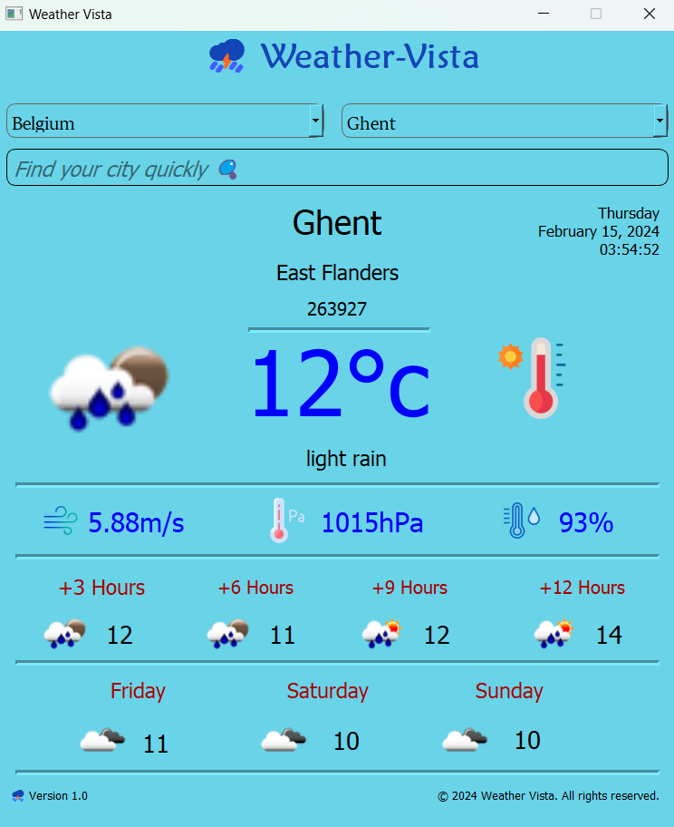

# Weather-Vista: A Graphical Weather Application

## Overview

Weather-Vista is a Python-based weather application designed to provide real-time weather information through a user-friendly graphical interface. The project utilizes PyQT5 for GUI, Scrapy for web scraping city data, HTTP-Request and API for real-time weather data, and MongoDB for efficient data storage.

## Key Features

- **User-Friendly Interface:** Enjoy a visually appealing and intuitive interface for seamless weather exploration.
- **Real-Time Weather Data:** Access up-to-date weather information, including temperature, conditions, and forecasts.
- **City Exploration:** Explore city details, such as temperature, weather conditions, and more, for selected countries.
- **Task Tracking with Trello:** Daily 30-minute meetings are held, and task details are tracked using Trello for effective collaboration.

## Technologies Used

- **PyQT5:** For GUI development.
- **Scrapy:** Web scraping to gather city, state, and population information.
- **HTTP-Request and API:** To pull real-time weather data from [OpenWeatherMap](https://openweathermap.org/api).
- **MongoDB:** As the database management system for efficient data storage.

## Project Structure

- **Sprint-1: Design and Database Setup**
  - Design GUI for App.
  - Create UML Diagrams (Use Case Diagram, Class Diagram).
  - Implement Scrapy for city, state, and population information.

- **Sprint-2: Real-Time Weather Integration**
  - Use HTTP-Request and API for real-time weather data.
  - Implement main page components, including country and city details.

## Meeting Schedule

1. **Project Kick-off Meeting/Sprint Planning Meeting:** 27-01-2024
2. **Daily Scrum Meeting:** Every day
3. **Retrospective Meeting / Sprint Planning Meeting:** 01-02-2024
4. **Sprint Review:** 08-01-2024

## How to Contribute

Weather-Vista welcomes contributions! To get started:
1. Join our daily meetings to stay updated.
2. Check out the Trello board for available tasks.
3. Contribute code or report issues.

## Installation and Usage

1. Clone the repository:
   ```bash
   git clone https://github.com/yaydemirpro/Weather-Vista.git
   cd Weather-Vista

2. Install the required dependencies:

3. Configure the database connection:
   - MongoDB is used as the database. Create a MongoDB database account and update the necessary connection details in the `db_connect.py` file.

4. Configure the API key:
   - An OpenWeatherMap API key is required. Obtain an API key and add it to the `get_complete_url()` and `get_forecast_url()` functions.

5. Run the application:
   ```bash
   python main.py

## Usage

1. When the application is launched, you will see options for countries and cities. After selecting the relevant country, a list of cities will appear. Once you select a city, weather information will be displayed at the bottom of the screen.

2. You can quickly access weather information for a city by typing the city name into the search box.

3. Weather information is presented in terms of current temperature, pressure, humidity, wind speed, and weather description.

## API and Database Operations

- The application fetches weather data using the OpenWeatherMap API.
- MongoDB is used as the database. City data for each country is stored in the database.

## License

This project is licensed under the Creative Commons Zero v1.0 Universal.

## Acknowledgements

Special thanks to OpenWeatherMap for providing the weather API.


## Weather-Vista User Guide



### Getting Started

When you launch the application, weather data is loaded, and the main screen is displayed.

### Main Screen

**Country and City Selection:**
- Use the dropdown menus to select a country and city.
- When you change the country, the list of cities for that country is automatically loaded.
- The selected city's weather information will be displayed in the main area of the screen.

**Real-Time Weather Information:**
- View real-time weather information, including temperature, pressure, humidity, wind speed, and weather description.

**Daily and Hourly Forecast:**
- Access daily and hourly weather forecasts for the selected city.
- Daily forecasts cover the next three days, while hourly forecasts cover 3, 6, 9, and 12-hour intervals.

**City Search:**
- Use the "Find your city quickly 🔍" search box to quickly find a city.
- Even if you don't enter the full city name, the search will still work. For example, typing "erda" will display "Amsterdam," and typing "han" will display "Hanover."

**Current Date and Time:**
- The top right corner of the screen displays the current date and time.

### Features

**Saved User Preferences:**
- The application remembers the last selected country and city, automatically loading them on the next startup.

**Animated Placeholder:**
- The search box's placeholder text is animated to provide search hints.

**Error Notifications:**
- If there is an error fetching or displaying weather data, an error message will be shown.

**Clean and User-Friendly Interface:**
- The application's interface is designed to provide easy access to weather information.

This guide covers the basic features of Weather-Vista and is designed to help users effectively use the application. Explore further to discover more features and enjoy using Weather-Vista!
